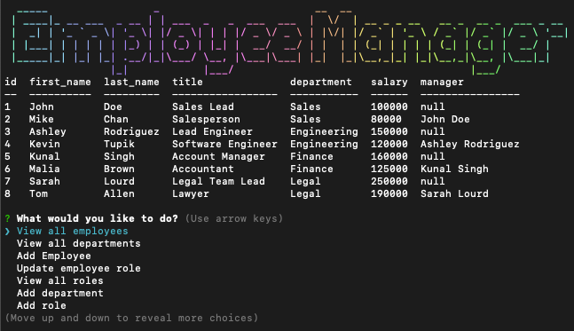

# employeeManagementSystem

  

  ## Description
  This application allows users to interact with information stored in a mySQL database. The content management system uses inquirer to prompt the user through a clean CLI user interface. The users input is used to make updates to the database. Use this [link](https://www.figma.com/file/zHnyrxzJL0rF4VKKNwWpQR/module12Flow?node-id=40%3A89&t=z7ELt4hw2RyrtqLH-1) to see a visual explanation of the branching prompts.

  ## Table of Contents
  - [Walkthrough Video](#Walkthrough)
  - [Thumbnail](#Thumbnail)
  - [Installation](#Installation)
  - [Usage](#Usage)
  - [License](#License)
  - [Contributing](#Contributing)
  - [Tests](#Tests)
  - [Questions](#Questions)

  ## Walkthrough Video
[Link to Walkthrough](https://drive.google.com/file/d/1kFifQOH2S97acJoQA1YCdgGwursh4-_6/view?usp=sharing)

  ## Thumbnail

  
  ## Installation
  To install necessary dependencies, run the following command:

  ` npm i; `

  ## Usage
  Be sure that your mySQL is running, add your mySQL password to the index.js connection section, navigate to the db directory and run source schema.sql, then run source seeds.sql. Once you have the db running and seeded you can navigate back to the main directory and use npm start to begin running the CMS in your CLI.

  ## License
  MIT
  Copyright 2023 jakeroth0

    Permission is hereby granted, free of charge, to any person obtaining a copy of this software and associated documentation files (the "Software"), to deal in the Software without restriction, including without limitation the rights to use, copy, modify, merge, publish, distribute, sublicense, and/or sell copies of the Software, and to permit persons to whom the Software is furnished to do so, subject to the following conditions:
    
    The above copyright notice and this permission notice shall be included in all copies or substantial portions of the Software.
    
    THE SOFTWARE IS PROVIDED "AS IS", WITHOUT WARRANTY OF ANY KIND, EXPRESS OR IMPLIED, INCLUDING BUT NOT LIMITED TO THE WARRANTIES OF MERCHANTABILITY, FITNESS FOR A PARTICULAR PURPOSE AND NONINFRINGEMENT. IN NO EVENT SHALL THE AUTHORS OR COPYRIGHT HOLDERS BE LIABLE FOR ANY CLAIM, DAMAGES OR OTHER LIABILITY, WHETHER IN AN ACTION OF CONTRACT, TORT OR OTHERWISE, ARISING FROM, OUT OF OR IN CONNECTION WITH THE SOFTWARE OR THE USE OR OTHER DEALINGS IN THE SOFTWARE.;

  ## Contributing
  make a pr

  ## Tests
  To run tests, run the following command:

  ` npm test `

  ## Questions
  If you have any questions about the repo, open an issue or contact me directly at jakeroth0@gmail.com. You can find more of my work on GitHub at [jakeroth0](https://github.com/jakeroth0).
